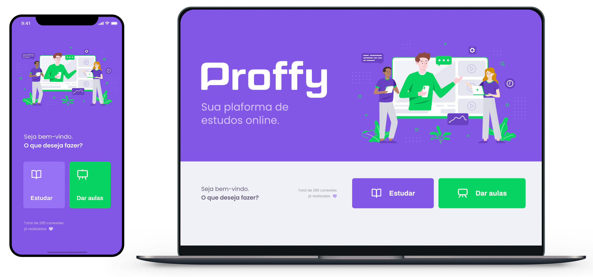

<div align="center"></div>

<p align="center">
  
  
  
  <br>
</p>

## :bookmark: Sobre

O **Proffy** é uma aplicação Web e Mobile feita para auxiliar na conexão entre os alunos e os professores. Logo, esta aplicação oferece aos professores a possibilidade de registrar aulas, podendo adicionar informações como a disciplina, o custo e horário e aos alunos a possibilidade de buscar pelas aulas cadastradas.

Este projeto foi idealizado pensando no **6 de agosto**, onde se comemora o **Dia Nacional dos Profissionais da Educação**.

Essa aplicação foi realizada durante a Next **Level Week #2**, projeto da [Rocketseat](https://rocketseat.com.br/).



# Instalação

Para clonar o repositório, execute o seguinte comando no terminal:
`git clone https://github.com/dyegosoriano/Proffy.git`

## Pré-Requisitos

`node, express, knex, sqlite, react, react-native, expo`

Clone o repositório, utilizando git clone ou faça o download do repositório.

Para iniciar o **Backend** utilize os comandos:

```
cd backend
yarn install && yarn dev:server
```

A API Node vai funcionar na porta `localhost:3333`.

Para iniciar o **Frontend** utilize os comandos:

```
cd frontend
yarn install && yarn start
```

Assim que o processo terminar, será aberta uma página no seu navegador `localhost:3000` contendo o projeto.

Para testar o **Mobile** do React Native, primeiro coloque o endereço do seu servidor (ou computador) no arquivo **src/services/api.js**, e depois execute os comandos:

```
# NÃO é preciso executar a linha de baixo caso ja tenha o Expo (CLI) instalado!
yarn global add install expo-cli
cd mobile
yarn install && expo start
```

Assim que o processo terminar, automaticamente será aberta no seu navegador a página `localhost:19002`. Conecte seu emulador, ou teste o aplicativo por `LAN`: baixe o aplicativo _Expo_ da Play Store ou App Store e em seguida escaneie o código QR. (Se não for por lan, tente por tunnel, espere aparecer no Metro Blunder(informações do Expo sobre o app) a mensagem _Tunnel Ready_ então clique em tunnel e escaneie o código QR.

# Back-End

Api desenvolvida em NodeJS com acesso a banco de dados relacional SQLite. Esta api faz uso do Knex.

As rotas para acessar a API estão no arquivo **routes.js**. Você pode testar as rotas antes de usar o frontend com o software Insomnia.

# Front-End (Web e Mobile)

Frontend web, desenvolvido em ReactJS. Nesta parte da aplicação, é possível entender diversos conceitos do React e do desenvolvimento web em geral.

Além disso, é muito importante entender como a página web normalmente se comunica com a API por meio de requisições http, as quais retornam ao frontend como um objeto json. Neste caso, foi utilizada a lib axios para realizar a comunicação com a api.

Com isso, a página da aplicação **Proffy** será aberta. Nela, um professor poderá se cadastrar ou um aluno pode procurar por professores particulares.

# Mobile

Desenvolvido com o framework React Native e com o Expo.

## :memo: Licença

Esse projeto está sob a licença MIT. Veja o arquivo [LICENSE](LICENSE.md) para mais detalhes.
